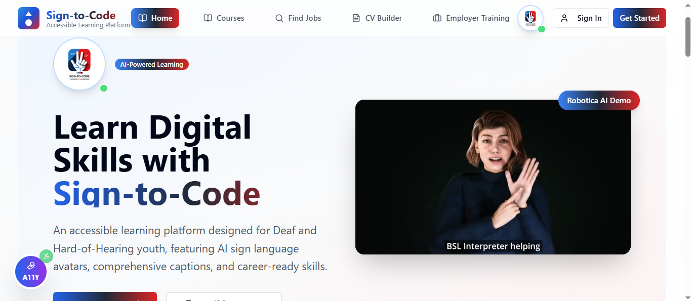
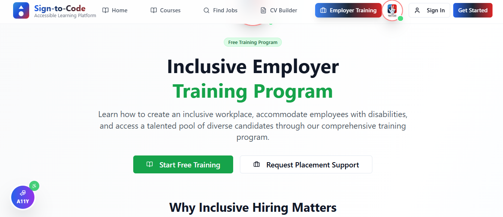
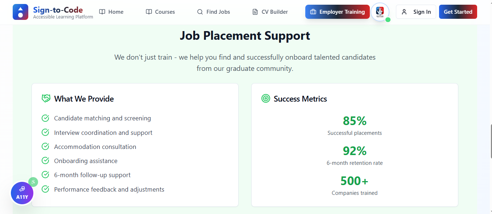

# 📚 Sign-to-Code LMS

An **accessible learning platform** designed for **Deaf and Hard-of-Hearing youth**, featuring AI sign-language avatars, captions, transcripts, a CV builder, and inclusive job placement support.  
The platform bridges the gap between **digital skills training** and **employment opportunities**, ensuring that no learner is left behind in Africa’s fast-growing digital economy.

---

## 🚀 Deployment  
👉 [Live Project Link](https://398999-0bfd722b94354f74b39f30fc74496e87-6-latest.app.mgx.dev/)

---

## 📸 Screenshots  

### Homepage  
  

### Accessibility Features  
- **Accessibility Center**  
  - High Contrast for better visibility  
  - Large Text for readability  
  - Dark Mode for user preference  
  - Reduced Motion to minimize distractions  

### Course Lessons  
- **Digital Skills Training**  
  - Courses tailored for Deaf/HoH learners  
  - AI-powered sign-language avatars  
  - Captions and transcripts for every lesson  
 

### Employer Training Program 
- **Inclusive Employer Training**  
  - Free training for companies  
  - Placement support for diverse candidates  
  

### Inclusive Job Finder 
- **Career Tools**  
  - CV Builder with accessibility-first design  
  - Integration with **BrighterMonday** and **Power Learn Talent Hub**  

 

### Free Courses  
 

### Job Placement Support  
- **Job Placement Support**  
  - Candidate matching & screening  
  - Interview coordination & support  
  - Onboarding and accommodation consultation  
  - 6-month follow-up support  
  - Proven metrics: **85% placement success, 92% retention rate**  

  

---

## 📊 Market Opportunity

- **34M Deaf/Hard-of-Hearing people in Africa** (WHO)  
- **Africa’s e-learning market**: $2.47B (2023), growing at **13.5% CAGR**, projected to reach **$3.18B by 2025** and **$4.6B by 2028**  
- Sign-to-Code taps into both **inclusive education demand** and the **fast-growing edtech sector**  

---

## 🛠️ Tech Stack

- **Frontend**: [Next.js](https://nextjs.org/) + [Tailwind CSS](https://tailwindcss.com/)  
- **Backend & Database**: [Supabase](https://supabase.com/) (Auth, Postgres, Storage)  
- **Payments Integration**: [Flutterwave](https://flutterwave.com/) / [IntaSend](https://intasend.com/)  
- **AI Integration**: Signvrse Avatars, [OpenAI](https://platform.openai.com/) / [DeepSeek](https://www.deepseek.com/)  

---

## 👥 Team

- **Rosemary Emeli** – Chief Executive Officer (CEO)  
  📧 [rose@sign2code.org](mailto:rose@sign2code.org)  
  🔗 [LinkedIn](https://www.linkedin.com/in/rosemary-emeli-b77bb9364/)  

- **Gideon Thuku** – Chief Technology Officer (CTO)  
  📧 [gideon@sign2code.org](mailto:gideon@sign2code.org)  
  🔗 [LinkedIn](https://www.linkedin.com/in/gideon-thuku-51096580/)  

---

## 📄 License

This project is licensed under the **MIT License**.  
You are free to use, modify, and distribute this project for educational and professional purposes, provided proper attribution is given.

---

## 🙌 Acknowledgements

- **WHO** for accessibility and Deaf/HoH population data  
- **BrighterMonday** & **Power Learn Talent Hub** for job integration  
- **Signvrse** for sign-language avatar technology  
- **Supabase**, **Next.js**, and **Tailwind CSS** for the core tech stack  
